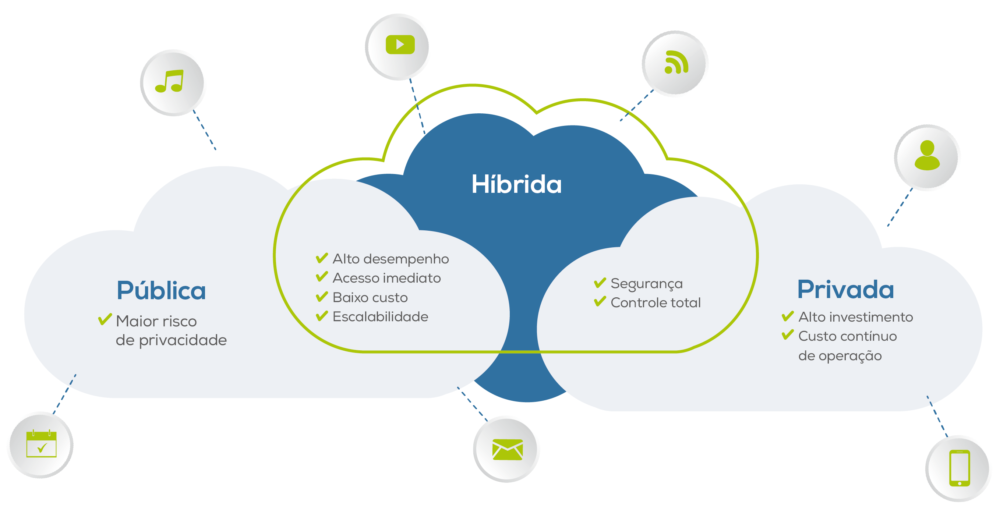

# Provedor de Nuvem Certificações (provedor-nuvem-cetifications)

Projeto prova de conceito - POC para aplicar os conhecimentos abstratos relacionados ao _**Protocolo de Trabalho Operacional das stacks de um Desenvolvedor Fullstack Multicloud**_!

--- 

## Visão do Projeto

Aqui buscamos responder: _**Quais são as  rotinas de trabalho de um desenvolvedor em cada provedor de nuvem?**_

O objetivo é ser agnóstico e abstrair a implantação da aplicação em um provedor de nuvem! Tendo em mente que a _**aplicação não precisa saber em quais nuvens se encontra implantada**_.

Focaremos em orientações práticas para implantação dos piperlines de CI / CD. Tendo em mente os seguintes tipos de Nuvem a seguir:



--- 

Tendo em mente que para todas as Certificações do presente POC, focaremos no Conteúdo Programático buscando identificar:
- Objetivo dos Tópicos, para cada tópico, explodir em Habilidades;
- Para cada habilidade, identificar boas práticas e seus usos Empíricos;
- Identificar a forma do como é cobrado o conhecimento no exame (principais pegadinhas);
- identificar, em projetos open-source, o uso dos conceitos na prática;
- Elaborar estratégias (checklists) de refatoração para aplicar boas práticas em projetos legados;

--- 

## Proficiências

Procuro evidência as proficiências nas seguintes habilidades técnicas:

- [Aplicativos Distribuidos como Software como Serviço (SaaS)](#STIGLER-Maddie) para consumir e gerar soluções com processamento distribuido e com computação em nuvem.
- [Preparando Cenários e com Casos de Uso de Negócios](#) usando os recursos de Plataforma como Serviço (PaaS) de cada Procedor de nuvem: 
  - Identificar o [Cenário de Negócios e Caso de Uso](#) 
  - Identificar o [Fluxo de Trabalho do Processo Compartilhado](#)
  - Identificar os Casos de Usos [Functions as a Service (FaaS)](#STIGLER-Maddie)
- Operacional de Trabalho [Desenvolvedor Multicloud](#STIGLER-Maddie) para cada nuvem a seguir:
  - [Amazon Web Services – AWS](certificacoes-aws/README.md)
    - [Certificação AWS Cloud Practitioner](certificacoes-aws/aws-cloud-practitioner-certification/README.md)
    - [Certificação AWS Certified DevOps Engineer – Professional](certificacoes-aws/aws-aws-devops-engineer-professional/README.md)
    - [Certificação AWS Certified Solutions Architect – Associate](certificacoes-aws/aws-solution-arch-associate-certification/README.md)
  - [Microsoft Azure](certificacoes-azure/README.md)
    - [Certificação Microsoft Certified: Azure Fundamentals (AZ-900)](certificacoes-azure/azure-fundamentals-az900/README.md)
    - []()
  - [Google Cloud Platform – GCP](certificacoes-gcp/README.md)
    - []()
    - []()
  - [RedHat OpenShift](certificacoes-redhat-openshift/README.md)
  - [Oracle Cloud](certificacoes-oc/README.md)
  - [Heroku – Plataform Cloud](certificacoes-hpc/README.md)
  - [Spring Cloud](certificacoes-sp/README.md)

Projeto inicializado com o [`Scripts de automação próprio`]().

## 🚀 Começando

### 🔧 Instalação

Para obter o presente projeto use os seguintes comandos:

```bash
mkdir -p "${HOME}/projetos"
cd "${HOME}/projetos"
git clone https://github.com/pssilva/provedor-nuvem-certifications.git
cd provedor-nuvem-certifications
source ~/.bash_profile
idea .
```

#### 📋 Pré-requisitos

Depois de baixar o projeto: De que coisas precisamos para atuar no projeto `provedor-nuvem-certifications` e executá-lo?

Para isso, use os comandos do script de automação:


```bash
<<<<<<< HEAD

export ARTIFACT_ID="provedor-nuvem-certifications"
export TOOL_NAME="ProvedorNuvemCertificationScriptsUteis"
export SCRIPT_PATH="${HOME}/projetos${ARTIFACT_ID}/scripts"
=======
<<<<<<< Updated upstream
[TRABALHO EM PROGRESSO]
=======

export ARTIFACT_ID="provedor-nuvem-certifications"
export TOOL_NAME="ProvedorNuvemCertificationScriptsUteis"
export SCRIPT_PATH="${HOME}/projetos/${ARTIFACT_ID}/scripts"
>>>>>>> docs-repo
export AUTOMATION_PATH="${SCRIPT_PATH}/src/main/automation"
export TOOL_PATH="${AUTOMATION_PATH}/${TOOL_NAME}"

source "${TOOL_PATH}/ProvedorNuvemCertificationScriptsUteis_main.sh"

ProvedorNuvemCertificationScriptsUteis.installAllTools
ProvedorNuvemCertificationScriptsUteis.makeAllTools

<<<<<<< HEAD
=======
>>>>>>> Stashed changes
>>>>>>> docs-repo
```

#### 📋 Criar Projetos de Certificação

Depois de baixar o projeto: Qual é o protocolo para gerar os projetos de Certificação modelo?

Para isso, use siga os passos:

  1. Adicionar uma linha no arquivo CSV: Artefato [`arquivo_certificacoes_parametors.csv`](scripts/src/main/automation/ProvedorNuvemCertificationScriptsUteis/datas/arquivo_certificacoes_parametors.csv)
  2. Usar o comando do scritp de Automação: 

      ```bash
      export AUTOMATION_PATH="${HOME}/projetos/provedor-nuvem-certifications/scripts/src/main/automation"
      export DATAS_PATH="${AUTOMATION_PATH}/ProvedorNuvemCertificationScriptsUteis/datas"

      export WORK_PATH="${HOME}/projetos/provedor-nuvem-certifications"
      export INPUT_FILE_CSV="${DATAS_PATH}/arquivo_certificacoes_parametors.csv"

      ProvedorNuvemCertificationScriptsUteis.processamentoCSV "${WORK_PATH}" "${INPUT_FILE_CSV}"

      ```

_**NOTA**_: Ou pode apenas usar o scritp de teste: Artefato [`arquivo_certificacoes_parametors.csv`](scripts/src/test/automation/ProvedorNuvemCertificationScriptsUteis/ProvedorNuvemCertificationScriptsUteis_processamentoCSV_test.sh)

---

## 🔩 Débitos Técnicos

Aqui temos uma lista do que idenficamos com status de pendente:

### Funcionalidades Aplicação

Segue abaixo (não se limita) os objetivos do presente projeto:

- [X] ~~Formatando documentação README.md~~
- [ ] Scripts de Automação:
  - [X] ~~Altoritmo de Processamento de Arquivo CSV: `ProvedorNuvemCertificationScriptsUteis.processamentoCSV`~~
  - [X] ~~Geração de Projeto de Certificação Específica de um Arquivo CSV: `ProvedorNuvemCertificationScriptsUteis.processamentoCSV`~~
  - [ ] Configuração do Ambiente de Desenvolvimento
  - [ ] instalação SDK de Cada Procedor de Nuvem:
    - [ ] instalação SDK [Amazon Web Services – AWS](certificacoes-aws/README.md)
    - [ ] instalação SDK [Microsoft Azure](certificacoes-azure/README.md)
    - [ ] instalação SDK [Google Cloud Platform – GCP](certificacoes-gcp/README.md)
    - [ ] instalação SDK [RedHat OpenShift](certificacoes-redhat-openshift/README.md)
    - [ ] instalação SDK [Oracle Cloud](certificacoes-oc/README)
    - [ ] instalação SDK [Heroku – Plataform Cloud](certificacoes-hpc/README.md)
    - [ ] instalação SDK [Spring Cloud](certificacoes-sp/README.md)

### Atividades - DevOps

- [ ] Implatação num Provedor de Nuvem (mais detalhes veja [aqui](docs/provedores_nuvem/README.md)).
- [ ] Implementar restrições de Commit no Git: vinculado com o ID de regra de negócio e ID do checklist de validação das entragas de funcionalidades (mais detalhes [aqui](docs/checklists/README.md))
- [ ] Implementar Dockerfiles para Kubernetes
- [ ] Colocar em prática o Desenvolvimento Orientado a Interface onde se deve desacoplar a aplicação do procedor de nuvem (Princípio da Segregação de Interface (ISP) - SOLID) (mais detalhes veja [aqui](docs/provedores_nuvem/README.md))
- [ ] Implementar Arquitetura Orienta a Eventos ([EDA](https://aws.amazon.com/pt/what-is/eda/))

### Suporte / Sustentação

- [ ] Abordagem API First e Implementação da Especificação do [OpenAPI (antido Swagger)](https://swagger.io/specification/) para integração com o back-end
- [ ] Clusterização da Solução em Diversas [VM em multicloud Nuvem]() para integração com o back-end

---

## Mentalidade PDCA

Tendo em mente que sempre buscamos melhorar o protocolo de trabalho operacinal do dia a dia usando empirismo (colocar realmente em prática os conheicmentos abstratos)

NOTA: Não se trata de ficar ditando regras no trabalho da equipe, mas sim melhorar o [meu operacional pessoal de trabalho](#da-analise-exploratoria) e com isso agregar valor melhorando a perfomance:


---

## Referências Usadas

Seque abaixo as referências bibliográficas usadas no presente projeto:

### Livros

---

<p align="justify">
[<a id="FOWLER-Martin">FOWLER, Martin , with contributions by Kent Beck. Refactoring: Improving the Design of Existing Code</a>]. Second Edition 2 Ed. Editora: Addison-Wesley Professional; 2nd ed. edição (19 novembro 2018) Cidade da publicação: Copyright © 2019 Pearson Education, Inc. 448 páginas. (Nome da série e/ou coleção, ISBN-13: 978-0-13-475759-9, ISBN-10: 0-13-475759-9). Disponível em: < <a href="https://a.co/d/0hvdoivW">https://a.co/d/8Yd4ysB</a> >. Acesso em: 18 jul. 2024.
</p>

---

<p align="justify">
[<a id="CASTRO-LEON">CASTRO-LEON, Enrique; HARMON, Robert</a>]; <a href="https://a.co/d/2eNpKAc">Cloud as a Service: Understanding the Service Innovation Ecosystem</a>.1 Ed.. Editora: Apress; 1st ed. edição (23 dezembro 2016). Copyright © 2016 by Enrique Castro-Leon and Robert Harmon. 337 páginas. (Library of Congress Control Number: 2016961822, ISBN-10: 1484201043; ISBN-13 : 978-1484201046). Disponível em: < <a href="https://a.co/d/2eNpKAc">https://a.co/d/2eNpKAc</a> >. Acesso em: 24 jul. 2024.
</p>

---

<p align="justify">
[<a id="STIGLER-Maddie">STIGLER, Maddie</a>]. <a href="https://a.co/d/7tIdtSM">Beginning Serverless Computing Developing with Amazon Web Services: Microsoft Azure, and Google Cloud. 1 Ed. Richmond, Virginia, USA</a>. Editora: Apress; 1st ed. edição (25 novembro 2017). Copyright © 2018 by Maddie Stigler. 199 páginas. (Nome da série e/ou coleção, ISBN-13 (pbk): 978-1-4842-3083-1). Disponível em: < <a href="https://a.co/d/7tIdtSM">https://a.co/d/7tIdtSM</a> >. Acesso em: 24 jul. 2024.
</p>

---

### Vídeos / Playlists

---