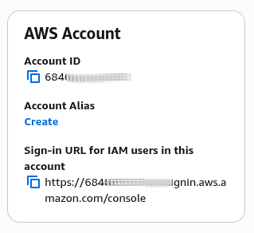

# Certificações AWS (certificacaões-aws)

Tendo em mente que para todas as Certificações do presente PoC, focaremos no Conteúdo Programático buscando identificar:
- Objetivo dos Domínios, para cada domínio, explodir em Tarefas (Tasks);
- Para cada Tarefa (Task), identificar as Habilidades (Skills);
- Para cada Habilidade (Skill), identificar boas práticas e usos Empíricos;
- Identificar a forma do como é cobrado o conhecimento no exame (principais pegadinhas);
- Identificar, em projetos open-source, o uso dos conceitos, na prática;
- Elabora os planos de ações e os seus respetivos checklists operaiconais de refatoração;
- Aplicar boas práticas em projetos legados;

### Evidências de Estudos

Para consolidação do conhecimento, usaremos a [Técnica Faynman](https://youtu.be/CN_SCpGuJ_w?si=cjZukoffz_HNxy7y), onde para cada item dos Tópicos da Certificação registramos:

- Aúdio Auto explicativo:
  - De cada conceito abstrato
  - Explicar uma questão específica do Exame;
- Ativação do conhecimento: escrever Manualmente (de 5x a 12x) as definições dos conceitos de memória;

##### Evidência Conta AWS

## Proficiências

Procuro evidência as proficiências nos domínios, tarefas, sua respectivas habilidades técnicas descritas nas seguintes certificações:

- [Amazon Web Services – AWS](certificacoes-aws/README.md)
  - [Certificação AWS Developer Associate](certificacoes-aws/aws-certified-developer-associate/README.md)
  - [Certificação AWS Certified Solutions Architect – Associate](certificacoes-aws/aws-certified-solutions-architect-associate/README.md)
  - [Certificação AWS Certified Solutions Architect - Professional](https://docs.aws.amazon.com/pt_br/aws-certification/latest/solutions-architect-professional-02/solutions-architect-professional-02.pdf#solutions-architect-professional-02)
  - [Certificação AWS Certified Security – Specialty](https://docs.aws.amazon.com/pt_br/aws-certification/latest/security-specialty-03/security-specialty-03.pdf#security-specialty-03)
  - [Certificação AWS Certified DevOps Engineer – Professional](certificacoes-aws/aws-aws-devops-engineer-professional/README.md)
  - [Certificação AWS Cloud Practitioner](certificacoes-aws/aws-cloud-practitioner-certification/README.md)

## 🔩 Débitos Técnicos

Aqui temos uma lista do que idenficamos com status de pendente:

### Funcionalidades Aplicação

Segue abaixo (não se limita) os objetivos do presente projeto:

- [X] ~~Formatando documentação README.md~~
- [ ] Indexação completa de cada vídeo da Playlist: [PLAYLIST 13 VÍDEOS – 03.04.07.62 –Fundamentos de Arquitetura de Software e System Design – por Renato Augusto – Questões](../docs/indexacoes/PLAYLIST%2013%20VÍDEOS%20–%2003.04.07.62%20–Fundamentos%20de%20Arquitetura%20de%20Software%20e%20System%20Design%20–%20por%20Renato%20Augusto%20–%20Questões.pdf)
  - Mais detalhes veja [aqui](../docs/indexacoes/README.md)

---

## Referências Usadas

Seque abaixo as referências bibliográficas usadas no presente projeto:

### Livros

---

[<a id="SK-Singh">SK Singh. AWS Certified Developer - Associate Exam Prep and Study Guide: Comprehensive Coverage of all Exam Domains | 195 Practice Questions with Answer Explanations ... Exam Tips & Caution Alerts</a>]. (English Edition) United States of America: Editora KnoDAX, 17 outubro 2024. Copyright © 2024 KnoDAX Número de páginas: 587 páginas . (ISBN-13: 9781234567890 / ISBN-10: 1477123456) . Disponível em: < <a href="https://a.co/d/0d8N0VqI">https://a.co/d/0d8N0VqI</a> >. Acesso em: 29 mai. 2026.

---

[<a id="SK-Singh-aws-certified-solutions">SK Singh. AWS Certified Solutions Architect - Professional All-in-One Exam Prep Guide: Comprehensive Coverage of all Domains | 5 Full-Length Practice Tests | Exam Tips & Caution Alerts</a>]. 1 Ed. Cidade da publicação: KnoDAX, October 11, 2024. 2806 páginas. (B0DJWK21NV) . Disponível em: < <a href="https://a.co/d/00YIUN91">https://a.co/d/00YIUN91</a> >. Acesso em: 4 jun. 2026.

---

[<a id="SCOTT-Stuart-BOOK-Adam">SCOTT, Stuart; BOOK, Adam.</a>]; <a href="https://a.co/d/0a7lIS0V">AWS Certified Security - Specialty (SCS-C02) Exam Guide - Second Edition: Get all the guidance you need to pass the AWS (SCS-C02) exam on your first attempt</a>. 2nd ed. Cidade da publicação: Packt Publishing, 16 abril 2024. 614 páginas. (ISBN-10: 1837633983 / ISBN-13: 978-1837633982). Disponível em: < <a href="https://a.co/d/0a7lIS0V">https://a.co/d/0a7lIS0V</a> >. Acesso em: 4 jun. 2026.

---

[<a id="GANESAN-Kamesh">GANESAN, Kamesh. Aws Certified Developer Associate All-In-One Exam Guide (Exam Dva-C01)</a>]. Cidade da publicação: McGraw-Hill Companies, 3 dezembro 2020. Número de páginas: 752 páginas. (ISBN-10: 1260460177 / ISBN-13: 978-1260460179). . Disponível em: < <a href="https://a.co/d/05RPqnHq">https://a.co/d/05RPqnHq</a> >. Acesso em: 29 mai. 2026.

---

### Vídeos / Playlists

---

 
[<a id="FUNDAMENTOS-ARQUITETURA-Software-System-Design">FUNDAMENTOS DE ARQUITETURA de Software e System Design</a>]. Direção: @Renato Augusto. Produção: @Renato Augusto. Realização: @Renato Augusto. Roteiro: @Renato Augusto. Fotografia: N/A. Intérpretes: N/A; Local: Canal do Youtube: <a href="https://www.youtube.com/@RenatoAugustoTech">@Renato Augusto</a>, 23 de fev. de 2025. (stream de vídeo, mp3, cor, legenda, tradução, web). Disponível em: < <a href="https://www.youtube.com/playlist?list=PLNHxHgB-_LTusKqdWaZJtRbcqEMXPZXtw"> https://www.youtube.com/playlist?list=PLNHxHgB-_LTusKqdWaZJtRbcqEMXPZXtw </a> >. Acesso em: 7. jun. 2026.

---