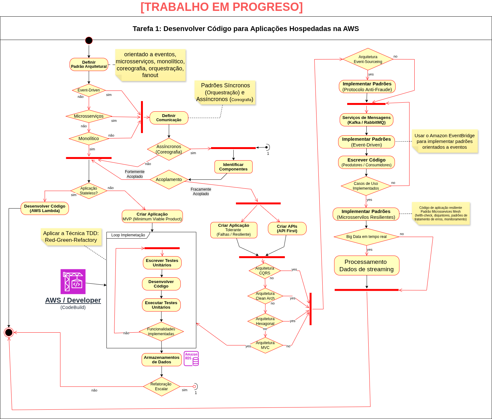

# Tarefa 1: Desenvolver código para aplicações hospedadas na AWS (d1-t1-desenvover-codigo-hospegar-aws)

### Evidências de Estudos

Para consolidação do conhecimento, usaremos a [Técnica Faynman](https://youtu.be/CN_SCpGuJ_w?si=cjZukoffz_HNxy7y), onde para cada item dos Tópicos da Certificação registramos:

- Aúdio Auto explicativo:
  - De cada conceito abstrato
  - Explicar uma questão específica do Exame;
- Ativação do conhecimento: escrever Manualmente (de 5x a 12x) as definições dos conceitos de memória;

#### Evidências 
Aplicação Prática do conhecimento.

##### Diagrama

## Tópicos da Certificação

Tomando como base os tópicos da [Certificação AWS Certified Developer – Associate (aws-certified-developer-associate)](https://aws.amazon.com/pt/certification/certified-developer-associate/?ch=sec&sec=rmg&d=1). 

### OBJETIVOS DO EXAME AWS ABORDADOS NESTE TÓPICO
- [ ] Domínio de Conteúdo 1: Desenvolvimento com Serviços AWS
  - [ ] Tarefa 1: Desenvolver código para aplicações hospedadas na AWS
    - Aqui temos 13 Habilidades (Skills):
      - [ ] Descrever padrões arquitetônicos 
          - (por exemplo, orientado a eventos, microsserviços, monolítico, coreografia, orquestração, fanout)
      - [ ] Descrever as diferenças entre conceitos com estado e sem estado
      - [ ] Descrever as diferenças entre componentes fortemente acoplados e fracamente acoplados
      - [ ] Descrever as diferenças entre padrões síncronos e assíncronos
      - [ ] Criar aplicações tolerantes a falhas e resilientes numa linguagem de programação 
          - (por exemplo, Java, C#, Python, JavaScript, TypeScript, Go)
      - [ ] Criar, estender e manter APIs 
          - (por exemplo, transformações de resposta/requisição, aplicação de regras de validação, sobrescrita de códigos de status)
      - [ ] Escrever e executar testes unitários em ambientes de desenvolvimento 
          - (por exemplo, usando AWS SAM)
      - [ ] Escrever código para usar serviços de mensagens
      - [ ] Escrever código que interaja com os serviços da AWS usando APIs e SDKs da AWS
      - [ ] Lidar com dados de streaming usando serviços da AWS
      - [ ] Usar o Amazon Q Developer para auxiliar no desenvolvimento
      - [ ] Usar o Amazon EventBridge para implementar padrões orientados a eventos
      - [ ] Implementar código de aplicação resiliente para integrações com serviços de terceiros (por exemplo, lógica de repetição, disjuntores, padrões de tratamento de erros)
