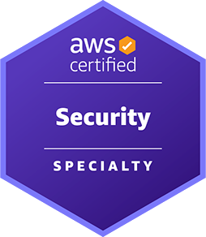
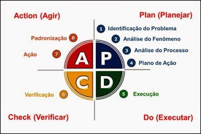

# Provedor Amazon Web Services – AWS: _**Certificação AWS Certified Security – Specialty**_

Projeto prova de conceito - POC para aplicar os conhecimentos abstratos relacionados ao protocolo 
de _**Trabalho Operacional das stack de um Desenvolvedor Cloud**_ especificamente para o provedor de nuvem Amazon Web Services – AWS!

## Visão do Projeto

Aqui buscamos responder: _**Quais são as rotinas de trabalho de um desenvolvedor em cada provedor de nuvem?**_

O objetivo é ser agnóstico e abstrair a implantação de qualquer aplicação num provedor de nuvem! 

Assumiremos que a _**aplicação não precisa saber em qual provedor de nuvem se encontra implantada**_.

Tendo em mente que para todas as Certificações do presente PoC, focaremos no Conteúdo Programático buscando identificar:
- Objetivo dos Domínios, para cada domínio, explodir em Tarefas (Tasks);
- Para cada Tarefa (Task), identificar as Habilidades (Skills);
- Para cada Habilidade (Skill), identificar boas práticas e usos Empíricos;
- Identificar a forma do como é cobrado o conhecimento no exame (principais pegadinhas);
- Identificar, em projetos open-source, o uso dos conceitos, na prática;
- Elabora os planos de ações e os seus respetivos checklists operaiconais de refatoração;
- Aplicar boas práticas em projetos legados;

--- 

## Proficiências

- [Aplicativos Distribuídos como Software como Serviço (SaaS)](#STIGLER-Maddie) para consumir e gerar soluções com processamento distribuido e com computação em nuvem.
- [Preparando Cenários e com Casos de Uso de Negócios](#) usando os recursos de Plataforma como Serviço (PaaS) de cada Procedor de nuvem:
    - Identificar o [Cenário de Negócios e Caso de Uso](#)
    - Identificar o [Fluxo de Trabalho do Processo Compartilhado](#)
    - Identificar os Casos de Usos [Functions as a Service (FaaS)](#STIGLER-Maddie)
- Operacional de Trabalho [Desenvolvedor Multicloud](#STIGLER-Maddie) para cada nuvem a seguir:
    - [Amazon Web Services – AWS](/README.md)
        - [Certificação AWS Certified Security – Specialty](https://docs.aws.amazon.com/pt_br/aws-certification/latest/security-specialty-03/security-specialty-03.pdf#security-specialty-03)

Projeto inicializado com o [`Scripts de automação próprio`]().

---

### Evidências de Estudos

Para consolidação do conhecimento, usaremos a [Técnica Faynman](https://youtu.be/CN_SCpGuJ_w?si=cjZukoffz_HNxy7y), onde para cada item dos Tópicos da Certificação registramos:

- Aúdio Auto explicativo:
    - De cada conceito abstrato
    - Explicar uma questão específica do Exame;
- Ativação do conhecimento: escrever Manualmente (de 5x a 12x) as definições dos conceitos de memória;

#### Evidência: {{TITULO_EVIDENCIA}}



## Tópicos da Certificação

Tomando como base os tópicos da [Certificação AWS Certified Security – Specialty](https://docs.aws.amazon.com/pt_br/aws-certification/latest/security-specialty-03/security-specialty-03.pdf#security-specialty-03)

### DOMÍNIOS DO EXAME AWS ABORDADOS NA CERTIFICAÇÃO
- [ ] Domínio do conteúdo 1: Detecção
  - Representa 16% do conteúdo pontuado
- [ ] Domínio do conteúdo 2: Resposta a incidentes
  - Representa 14% do conteúdo pontuado
- [ ] Domínio do conteúdo 3: Segurança de infraestrutura
  - Representa 18% do conteúdo pontuado
- [ ] Domínio do conteúdo 4: Gerenciamento de identidade e acesso
  - Representa 20% do conteúdo pontuado
- [ ] Domínio do conteúdo 5: Proteção de dados
  - Representa 18% do conteúdo pontuado
- [ ] Domínio do conteúdo 6: Fundamentos de segurança e governança
  - Representa 14% do conteúdo pontuado


## 🚀 Começando

### 🔧 Instalação

Para obter o presente projeto use os seguintes comandos:

```bash
mkdir -p "${HOME}/projetos"
export ARTIFAC_ID="provedor-nuvem-cetifications"
export CERTIFICATION_ARTIFAC_ID="aws-certified-security-specialty"
cd "${HOME}/projetos"
git clone https://github.com/pssilva/provedor-nuvem-cetifications.git
cd "${ARTIFAC_ID}/${CERTIFICATION_ARTIFAC_ID}"
source ~/.bash_profile
idea .
```

#### 📋 Pré-requisitos

Depois de baixar o projeto: De que coisas precisamos para atuar no projeto `provedor-nuvem-cetifications/aws-certified-security-specialty` e executá-lo?

Para isso, use os comandos do script de automação:

```bash
export ARTIFACT_ID="provedor-nuvem-certifications"
export TOOL_NAME="ProvedorNuvemCertificationScriptsUteis"
export SCRIPT_PATH="${HOME}/projetos${ARTIFACT_ID}/scripts"
export AUTOMATION_PATH="${SCRIPT_PATH}/src/main/automation"
export TOOL_PATH="${AUTOMATION_PATH}/${TOOL_NAME}"

source "${TOOL_PATH}/ProvedorNuvemCertificationScriptsUteis_main.sh"

ProvedorNuvemCertificationScriptsUteis.installAllTools
ProvedorNuvemCertificationScriptsUteis.makeAllTools
```

--- 

## 🔩 Débitos Técnicos

Aqui temos uma lista do que idenficamos com status de pendente:

### Funcionalidades Aplicação

Segue abaixo (não se limita) os objetivos do presente projeto:

- [X] ~~Formatando documentação README.md~~


--- 

## Mentalidade PDCA

Tendo em mente que sempre buscamos melhorar o protocolo de trabalho operacinal do dia a dia usando empirismo (colocar realmente em prática os conheicmentos abstratos)

NOTA: Não se trata de ficar ditando regras no trabalho da equipe, mas sim melhorar o [meu operacional pessoal de trabalho](#da-analise-exploratoria) e com isso agregar valor melhorando a perfomance:



---

## Referências Usadas

Seque abaixo as referências bibliográficas usadas no presente projeto:

### Livros

---

<p align="justify">
[<a id="SCOTT-Stuart-BOOK-Adam">SCOTT, Stuart; BOOK, Adam.</a>]; <a href="https://a.co/d/0a7lIS0V">AWS Certified Security - Specialty (SCS-C02) Exam Guide - Second Edition: Get all the guidance you need to pass the AWS (SCS-C02) exam on your first attempt</a>. 2nd ed. Cidade da publicação: Packt Publishing, 16 abril 2024. 614 páginas. (ISBN-10: 1837633983 / ISBN-13: 978-1837633982). Disponível em: < <a href="https://a.co/d/0a7lIS0V">https://a.co/d/0a7lIS0V</a> >. Acesso em: 4 jun. 2026.
</p>

---

### Vídeos / Playlists

---
