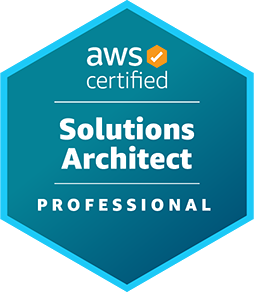

# Domínio do conteúdo 3: Melhoria contínua das soluções existentes (d3-melhoria-continua-solucoes-existentes)

### Evidências de Estudos

Para consolidação do conhecimento, usaremos a [Técnica Faynman](https://youtu.be/CN_SCpGuJ_w?si=cjZukoffz_HNxy7y), onde para cada item dos Tópicos da Certificação registramos:

- Aúdio Auto explicativo:
  - De cada conceito abstrato
  - Explicar uma questão específica do Exame;
- Ativação do conhecimento: escrever Manualmente (de 5x a 12x) as definições dos conceitos de memória;

#### Evidência: {{TITULO_EVIDENCIA}}

## Tópicos da Certificação

Tomando como base os tópicos da Certificação [AWS Certified Solutions Architect - Professional (SAP-C02) (aws-certified-solutions-architect-professional)](https://aws.amazon.com/pt/certification/certified-solutions-architect-professional/?ch=sec&sec=rmg&d=1 ). 

### OBJETIVOS DO EXAME AWS Certificação	 ABORDADOS NESTE TÓPICO
- [ ] Domínio do conteúdo 3: Melhoria contínua das soluções existentes
  - peso no exame: 25% da pontuação do conteúdo
    - [ ] Tarefa 1: Determinar uma estratégia para melhorar a excelência operacional geral
    - [ ] Tarefa 2: Determinar uma estratégia para melhorar a segurança
    - [ ] Tarefa 3: Determinar uma estratégia para melhorar o desempenho
    - [ ] Tarefa 4: Determinar uma estratégia para melhorar a confiabilidade
    - [ ] Tarefa 5: Identificar oportunidades para otimizações de custos
  