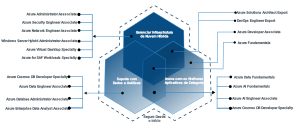

# Certificações Microsoft Azure (certificacoes-azure)

Projeto prova de conceito - POC para aplicar os conhecimentos abstratos relacionados ao protocolo de _**Trabalho Operacional das stack de um Desenvolvedor Cloud**_ especificamente para o provedor de nuvem [Microsoft Azure](https://azure.microsoft.com/pt-br/)!

<a href="https://cdn-dynmedia-1.microsoft.com/is/content/microsoftcorp/microsoft/final/en-us/microsoft-brand/documents/Azure-Certification-poster.pdf" id="mp-azure-certifications">

</a>

## Visão do Projeto

Aqui buscamos responder: _**Quais são as  rotinas de trabalho de um desenvolvedor em cada provedor de nuvem?**_

O objetivo é ser agnóstico e abstrair a implantação da aplicação em um provedor de nuvem! Tendo em mente que a _**aplicação não precisa saber em quais nuvens se encontra implantada**_.

--- 

Tendo em mente que para todas as Certificações do presente POC, focaremos no Conteúdo Programático buscando identificar:
- Objetivo dos Tópicos, para cada tópico, explodir em Habilidades;
- Para cada habilidade, identificar boas práticas e seus usos Empírico;
- Identificar a forma do como é cobrado o conhecimento no exame;
- identificar, em projetos open-source, o uso dos conceitos na prática;
- Elaborar estratégias (checklists) de refatoração para aplicar boas práticas em projetos legados;

--- 


## 🚀 Começando

### 🔧 Instalação

Para obter o presente projeto use os seguintes comandos:

```bash
mkdir -p "${HOME}/projetos"
cd "${HOME}/projetos"
git clone https://github.com/pssilva/provedor-nuvem-certifications.git
cd provedor-nuvem-certifications/certificacoes-azure
source ~/.bash_profile
idea .
```